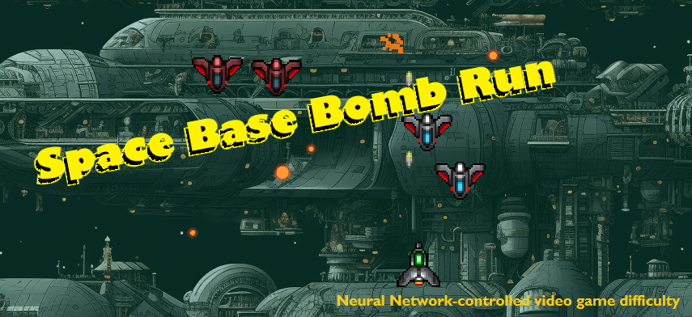

# Space Base Bomb Run

A bullet-hell space shooter where difficulty is controlled in real-time by a small transformer neural network — a **Game Master AI** trained entirely on human-labeled gameplay data.

This is a complete end-to-end ML-in-games tech demo: collect telemetry → annotate by hand → train a transformer → export weights to JSON → run embedded inference in pure GDScript, **no Python required at runtime**.

---

## Quick Start

1. Install [Godot 4.2+](https://godotengine.org/)
2. Clone this repo and open `project.godot`
3. Press **F5**

A pre-trained model (`ai/weights.json`) is included — the GM-AI is active from the first game. No Python setup needed.

### Controls

| Key | Action |
|---|---|
| Arrow keys / WASD | Move |
| Space | Fire |
| Enter | Start / restart |
| **V** | Toggle GM-AI visualizer overlay |

Press **V** during play to open a debug overlay showing the network's live action probabilities and the last decision it made.

---

## How the GM-AI Works

Every few seconds the model observes a snapshot of the game state and picks one of 13 difficulty actions:

| Action | Effect |
|---|---|
| `hold` | Skip this spawn tick |
| `budget_increase / decrease` | Grow or shrink the next wave |
| `rate_increase / decrease` | Speed up or slow down spawns |
| `force_swarm` | Pack 4 enemies into one wave |
| `force_elite` | Send a bruiser (3 HP, fires) |
| `force_chase` | Send hunters that track the player |
| `force_diagonal` | Send a diagonal wave |
| `force_rest` | Pause spawning for 3 ticks — deliberate breather |
| `clear_screen` | Instantly remove all enemies — emergency relief |
| `surge` | Max budget + faster spawns — maximum pressure |
| `ease` | Min budget + slower spawns + skip — maximum relief |

The model learns *when* to apply each action by training on examples where a human annotator watched gameplay snapshots and chose the most appropriate response.

---

## Architecture

```
Gameplay snapshot (every 4s)
        │
        ▼
  20 input features
  ┌────────────────────────────────────┐
  │  player position & invincibility   │
  │  enemy counts by type              │
  │  total threat on screen            │
  │  rolling kills/hits (10s window)   │
  │  score gained (10s window)         │
  │  spawn budget                      │
  │  bullet counts                     │
  └────────────────────────────────────┘
        │
        ▼  z-score normalisation
        │
  Rolling buffer of last 8 snapshots (8 × 20)
        │
        ▼
  ┌──────────────────────────────────┐
  │   Input projection  (20 → 64)   │
  │   Positional embedding (8 × 64) │
  │                                 │
  │   Transformer encoder × 2       │
  │   ├─ Multi-head self-attention  │
  │   │   (4 heads, d_head=16)      │
  │   └─ Feed-forward (64→128→64)   │
  │                                 │
  │   Final LayerNorm               │
  │   Linear head   (64 → 13)       │
  │   Softmax                       │
  └──────────────────────────────────┘
        │
        ▼
  13 action weights (sum to 1.0)
  → argmax → apply action
```

**~55,000 parameters.** Trains in under a minute on CPU. Inference runs in GDScript in under 1 ms.

---

## Reproducing the Experiment

The full pipeline from scratch: collect data → label → train → export → play.

### Prerequisites

- Python 3.10+
- Godot 4.2+

```bash
pip install -r gm_ai/requirements.txt
```

### 1. Collect Telemetry

Start a game session with **"Record telemetry & screenshots"** checked (the default). The game writes a timestamped CSV and screenshot folder to `data/` every 4 seconds automatically.

### 2. Label the Data

```bash
python tools/labeler.py
# Open http://localhost:5000
```

For each snapshot you see the screenshot alongside key stats (lives, score, threat, enemy counts, time since last hit). Select 1–3 actions that represent the best response, adjust their relative weights if needed, and click **Label & Next**. Progress is saved so you can pause and resume any session.

### 3. Train

```bash
python gm_ai/train.py
```

Trains for up to 300 epochs with early stopping (patience = 25). Outputs go to `gm_ai/checkpoints/`.

### 4. Export to JSON

```bash
python gm_ai/export_weights.py
```

Flattens all weights and normalisation stats into `gm_ai/checkpoints/weights.json`. Copy it to `ai/weights.json` in the project root, then run the game.

---

## Technical Details

### Input Features (20)

| Feature | Description |
|---|---|
| `play_time` | Seconds since game start |
| `score` | Absolute score |
| `score_gained_10s` | Score earned in the last 10 seconds |
| `lives` | Remaining lives |
| `player_x_norm` | Player X position (0–1) |
| `player_y_norm` | Player Y position (0–1) |
| `is_invincible` | Post-hit invincibility flag (0/1) |
| `time_since_last_hit` | Seconds since last player hit (capped at 999) |
| `enemy_count` | Total enemies on screen |
| `scout_count` | Fast diagonal enemies |
| `hunter_count` | Chase enemies |
| `bruiser_count` | Slow, tanky, shooting enemies |
| `total_threat_on_screen` | Sum of threat values of all enemies |
| `avg_enemy_y_norm` | Average enemy Y — how deep they've pushed |
| `nearest_enemy_dist_norm` | Distance to closest enemy (normalised) |
| `player_bullets` | Player projectiles on screen |
| `enemy_bullets` | Enemy projectiles on screen |
| `spawn_budget` | Current threat budget for the next wave |
| `kills_10s` | Kills in the last 10 seconds |
| `hits_10s` | Player hits taken in the last 10 seconds |

### Model

| Property | Value |
|---|---|
| Architecture | Transformer encoder |
| Parameters | ~55,273 |
| Sequence length | 8 snapshots |
| d_model | 64 |
| Attention heads | 4 |
| Encoder layers | 2 |
| Feed-forward dim | 128 |
| Loss | KL divergence (soft labels) |
| Optimizer | Adam + cosine LR schedule |
| Regularisation | Dropout 0.3, weight decay 1e-4, gradient clipping |

### Why Soft Labels?

Rather than forcing annotators to pick exactly one "correct" action, the labeler accepts 1–3 actions with relative weights (e.g. `surge: 0.6, budget_increase: 0.4`). These are normalised to sum to 1.0 and used as soft training targets with KL divergence loss. This reflects the genuine ambiguity of difficulty decisions and prevents the model from being overconfident.

### Enemy Types

| Type | HP | Speed | Pattern | Fires | Threat |
|---|---|---|---|---|---|
| Scout | 1 | 175 px/s | diagonal | No | ≈3.7 |
| Hunter | 2 | 100 px/s | chase | No | ≈5.3 |
| Bruiser | 3 | 70 px/s | any | Yes (0.5/s) | ≈6.4 |

---

## Project Structure

```
Space-Base-Bomb-Run/
├── ai/
│   └── weights.json          # Pre-trained model — loaded by Godot at startup
├── gm_ai/
│   ├── model.py              # Transformer definition (PyTorch)
│   ├── dataset.py            # Data loading & normalisation
│   ├── train.py              # Training loop
│   ├── export_weights.py     # Export weights to JSON for GDScript
│   ├── serve.py              # HTTP inference server (development only)
│   └── requirements.txt
├── scenes/
│   ├── level_controller.gd   # Game loop, spawning, UI
│   ├── gm_controller.gd      # GM action selection & execution
│   ├── gm_inference.gd       # Transformer forward pass in GDScript
│   ├── gm_visualizer.gd      # Debug overlay (press V)
│   ├── telemetry.gd          # Snapshot & screenshot collection
│   └── ...
├── tools/
│   └── labeler.py            # Web UI for human annotation
└── project.godot
```

> **Note:** The `data/` directory (telemetry CSVs and screenshots) is gitignored — run the game to generate your own.

---

## Development Notes

**Embedded inference** — `gm_inference.gd` loads `ai/weights.json` at startup and runs the full transformer forward pass in pure GDScript. No Python process, no native plugin, no dependencies.

**HTTP fallback** — `gm_ai/serve.py` is a Flask server the game can query instead of using the embedded weights. Useful when iterating on the model quickly: retrain, restart the server, and test without the export/copy step. The game uses embedded inference whenever `ai/weights.json` is present.
